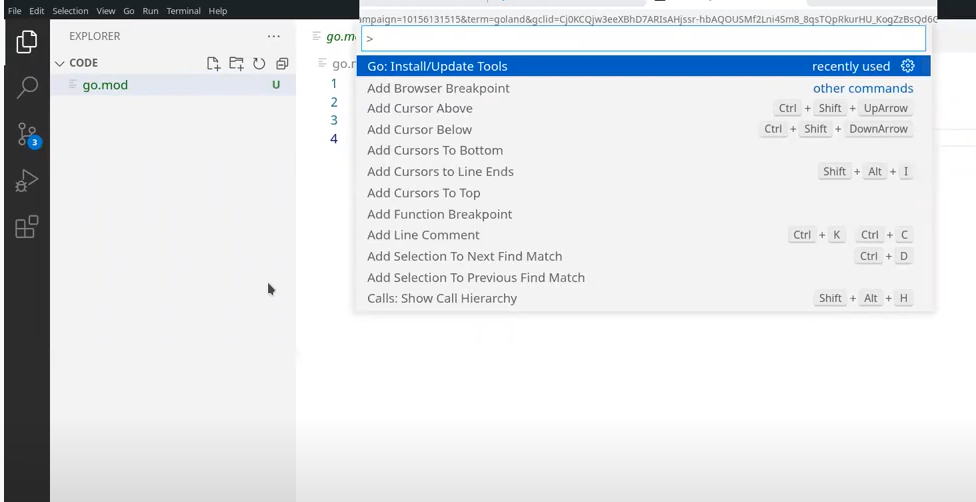
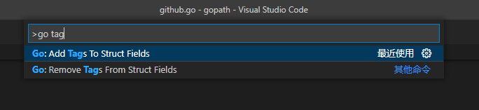
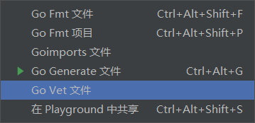

# go基础

事项表

## 第一天

### 议程

- 字符串和格式化输出
  - 什么是字符串？
  - Unicode 基础
  - 使用 fmt 包进行格式化输出
- 调用 REST API
  - 使用 net/http 进行 HTTP 调用
  - 定义结构
  - 序列化 JSON
- 处理文件
  - 处理错误
  - 使用 defer 管理资源
  - 使用 io.Reader 和 io.Writer 接口


1.配置vscode环境





### 1.字符串

#### Unicode

Unicode是一种编码，原来使用ASCII码，只能对英文和一些字符进行编码。

由于越来越多的国家加入互联网。需要对其他语言进行编码。

采用Unicode


一个Unicode字符通常表示为

> U+4AE0，由U+开始，后面是16进制数，总共两个字节，16位


一个Unicode编码常用的数据类型是int32，这也是Go里面的rune类型


#### UTF8

> **UTF8是一个将Unicode码点编码为字节序列的变长编码**。UTF8编码由Go语言之父Ken Thompson和Rob Pike共同发明的，现在已经是Unicode的标准。


### 2.REST API和JSON


我们输出的body和我们浏览器看到的body输出格式不一样的原因是

User-Agent


浏览器的body是面向人的，我们在程序中输出的body，是面向go的


#### JSON

如果我们想自定义结构体字段的名称，使用tag

```
type Reply struct{
	Name string
	NumRepos `json:"public_repos" `
}
```


在vscode中，我们ctrl + shift + p，使用go tag，可以给struct加tag




> 


### 3.处理文件

> 为什么打开文件后要关闭文件，
>
> 因为一台服务器上的文件描述符打开个数是有限制的
>
> ulimit -a，
>
> 为了避免资源的耗尽，出现错误，所以我们要关闭文件。


指向文件的指针是nil

```go
package main

import "os"

func main() {
	var f *os.File
	f.Close()
}
```

文件依然正常关闭


gzip

> gz结尾的文件表示是用gzip压缩的文件
>
> 但通常gzip仅用来压缩单个文件。多个文件的压缩归档通常是首先将这些文件合并成一个[tar](https://zh.m.wikipedia.org/wiki/Tar_(计算机科学))文件，然后再使用gzip进行压缩，最后生成的`.tar.gz`或者`.tgz`文件就是所谓的“tar压缩包”或者“tarball”。


## 第二天

- Sorting
  - 使用切片
  - 写methods
  - 理解接口
- 捕获恐慌
  - 内置的recover功能
  - 命名的返回值
- 处理文本
  - 使用bufio.Scanner逐行读取
  - 使用正则表达式
  - 使用maps


### Slice

左闭右开

下标（1-2）

s4 = s4[1:3]


默认下限是0，我们通过这种方式改变slice的len

> s4 = s4[:5]        
>
> s4 = s4[0:5]


默认上限是cap(s4)

> s4 = s4[1:]
>
> s4 = s4[1:cap(s4)]


```go
	s4 := make([]int, 4, 6)
	fmt.Printf("s4: len(%d) cap(%d)\n", len(s4), cap(s4))

	s4 = s4[:5]
	fmt.Printf("s4: len(%d) cap(%d)\n", len(s4), cap(s4))
```


连接两个slice

> 我们可以使用append(s1,s2...)

```go
func concat(s1, s2 []string) []string {
	s := make([]string, len(s1)+len(s2)+1)
	copy(s[:len(s1)], s1)
	copy(s[len(s1):], s2)
	// s3 := append(s1, s2...)
	return s
}
```


> copy返回的两个slice的指针地址不同


一般函数内的变量都被分配在栈上，但是在go里面这个不会。

> go会对变量做逃逸分析，将这个变量分配在heap（堆）上

> go build -gcflags=-m
>
> 让go编译器解释下他正在做什么


### 结构体、method、interface

> 像Java、C++中的构造器一样
>
> Go默认使用NewXxx构建一个新的结构体


```go
package main

import "fmt"

func main() {
	var i1 Item
	fmt.Println(i1)
	fmt.Printf("%#v", i1)
}

// 一般栈中的变量都是在方法用完，自动回收的
// 这里我们返回了一个以后还要用的变量
// Go会对这个做"逃逸分析"，将我们的变量分配到堆中
func NewItem(x, y int) (*Item, error) {
	if x < 0 || x > maxX || y < 0 || y > maxY {
		return nil, fmt.Errorf("%d,%d out of bound %d,%d", x, y, maxX, maxY)
	}
	i := Item{x, y}
	// i := ItemErrorf()
	// 	X: x,
	// 	Y: y,
	// }
	return &i, nil
}

const (
	maxX = 1000
	maxY = 600
)

type Item struct {
	X int
	Y int
}
```


### 结构体嵌入类型的选择

```go
type Player struct{
	Name string
	X int
	Item 
}

type Item struct{
	X int
	Y int
}

func main(){
	p1 := Player{"Jack",100,Item{500,300}}
	// 这两个是不冲突的
	// 当我们使用p1.X，他自然知道是外面的X
	fmt.Printf("p1: %#v",p1.X)
	fmt.Printf("p1: %#v",p1.Item.X)
}
```

冲突的版本

```go
type Player struct{
	Name string
	T
	Item 
}

type Item struct{
	X int
	Y int
}
type T struct{
	X int
}

func main(){
	p1 := Player{"Jack",100,Item{500,300}}
	// p1.X会引发冲突，因为编译器不知道想要的是哪个里面的X
	fmt.Printf("p1: %#v",p1.X)
	fmt.Printf("p1: %#v",p1.Item.X)
}
```


### String方法

> 像Java那种每个类或者变量有toString()方法
>
> Go里面提供了类似的方法


只要一个结构体或者type实现了String方法，当我们使用fmt.Println()打印时，我们即使用我们的String方法。

实际上，我们实现了String方法，即是实现了fmt包下的Stringer接口


> go vet


go vet是一个代码静态检查的工具，帮助我们在编译和运行期间检查bug

> 下面代码在vscode和goland中都会警告
>
> 产生了递归调用

```go
package main

import "fmt"

func main() {

}

type Key byte

// go's version enum
const (
	Jade Key = iota + 1
	copper
	crystal
)

// Implement fmt.Stringer interface
func (k Key) String() string {
	switch k {
	case Jade:
		return "Jade"
	case copper:
		return "copper"
	case crystal:
		return "crystal"
	}
	// return fmt.Sprintf("<Key %v>", k)
	// 递归调用
	return fmt.Sprintf("<Key %s>", k)
}
```

我们也可以在goland中手动执行 go vet





当我们运行 go test后，他会自动运行go vet


### 类型断言、type switch

> var i any == var i interface{}
>
> 类型断言是什么
>
> i = "ss"
>
> i.(string)
>
> 


### panic

> 为什么要对panic进行recover()
>
> 因为panic会终止程序的运行

example

```go
package main

import (
	"fmt"
	"log"
)

func main() {
	fmt.Println(safeDiv(1, 0))
	fmt.Println("hello")
}

func safeDiv(a, b int) (int, error) {
	defer func() {
		if e := recover(); e != nil {
			log.Println("Error", e)
		}
	}()
	return a / b, nil
}
func div(a, b int) int {
	return a / b
}

```


## 第三天

- 分配工作
  - 使用 goroutines & channels
  - 使用 sync 包来协调工作
- 超时和取消
  - 使用select选择多个channel
  - 使用上下文进行超时和取消
  - 标准库对上下文的支持


> go runtime 不会等待goroutine，除了main

> goroutine一旦开始你就无法访问它，它没有一个全局的id，像进程pid那样我们能kill掉


### channel语义

> send 和 receive将会阻塞
>
> 发送者将会一直阻塞，直到有人接收，
>
> 接收者将会一直阻塞，知道有人发送

> received from a closed channel will return zero value without blocking
>

> 我们将会收到零值从一个关闭的channel，这个零值指的是channel的类型

> send to a closed channel will panic

> closing a closed channel will panic

> send/receive to a nil channel will block forever

> channel不是队列


> 我们可以命名一个有方向的channel
